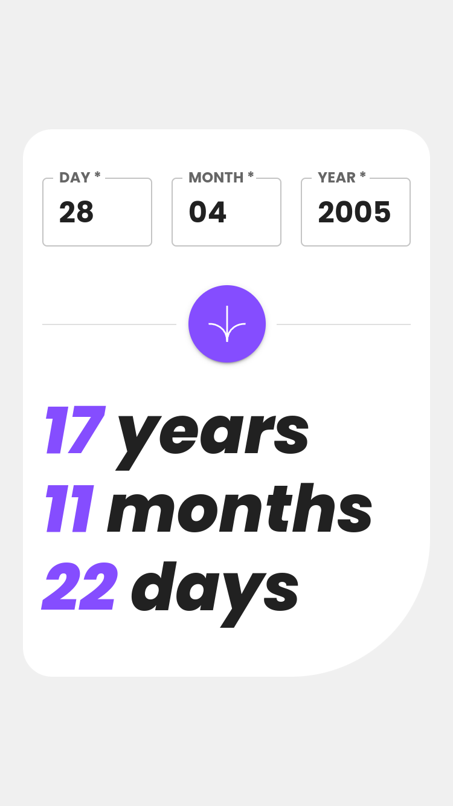

# Frontend Mentor - Age calculator app solution

This is a solution to the [Age calculator app challenge on Frontend Mentor](https://www.frontendmentor.io/challenges/age-calculator-app-dF9DFFpj-Q). Frontend Mentor challenges help you improve your coding skills by building realistic projects.

## Overview

### The challenge

Users should be able to:

-   View an age in years, months, and days after submitting a valid date through the form
-   Receive validation errors if:
    -   Any field is empty when the form is submitted
    -   The day number is not between 1-31
    -   The month number is not between 1-12
    -   The year is in the future
    -   The date is invalid e.g. 31/04/1991 (there are 30 days in April)
-   View the optimal layout for the interface depending on their device's screen size
-   See hover and focus states for all interactive elements on the page
-   **Bonus**: See the age numbers animate to their final number when the form is submitted

### Screenshot

### Links

-   Solution URL: [https://www.frontendmentor.io/solutions/progressive-web-app-built-with-vite-react-using-material-ui-JEbX_eVRIo](https://www.frontendmentor.io/solutions/progressive-web-app-built-with-vite-react-using-material-ui-JEbX_eVRIo)
-   Live Site URL: [https://erlynascarate.github.io/age-calculator-app/](https://erlynascarate.github.io/age-calculator-app/)

## Built with

-   Mobile-first workflow
-   [Vite](https://vitejs.dev/)
-   [React](https://reactjs.org/) - JS library
-   [Material UI](https://mui.com/) - UI library
-   [PWA Vite Plugin](https://vite-pwa-org.netlify.app/)

## Author

-   Frontend Mentor - [@erlynascarate](https://www.frontendmentor.io/profile/erlynascarate)
-   Twitter - [@erlynascarate](https://www.twitter.com/erlynascarate)
